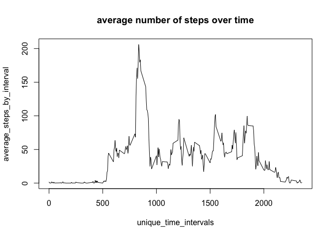

# Reproducible Research: Peer Assessment 1
Xin Chen  

## Loading and preprocessing the data

We create a new variable called "datetime", which is the time stamp for each
obervation.


```r
rm(list=ls())
activity = read.csv("activity.csv", colClasses = c("integer", "character", "character"))
datetime = do.call(c, apply(activity, 1, 
                 function(tmp){
                       hour = as.numeric(tmp[3]) %/% 60
                       minute = as.numeric(tmp[3]) %% 60
                       time_str = paste(hour, minute, sep = ":")
                       datetime = paste(tmp[2], time_str)
                       strptime(datetime, "%Y-%m-%d %H:%M")  
                 }
                 )
)
activity = cbind(activity, datetime)
str(activity)
```

```
## 'data.frame':	17568 obs. of  4 variables:
##  $ steps   : int  NA NA NA NA NA NA NA NA NA NA ...
##  $ date    : chr  "2012-10-01" "2012-10-01" "2012-10-01" "2012-10-01" ...
##  $ interval: chr  "0" "5" "10" "15" ...
##  $ datetime: POSIXct, format: "2012-10-01 00:00:00" "2012-10-01 00:05:00" ...
```

## What is mean total number of steps taken per day?

```r
# remove NA rows
activity_noNA = subset(activity, !is.na(activity$steps))

# find unique dates
unique_dates = unique(activity_noNA$date)

# compute the total number of steps per day
total_steps = sapply(unique_dates, 
                     function(x) 
                             sum(subset(activity_noNA, activity_noNA$date == x)$steps)
)

# plot histogram
hist(total_steps, main = "Histogram of total steps per day")
```

<!-- -->

```r
# compute the mean
(mean_steps = mean(total_steps))
```

```
## [1] 10766.19
```

```r
# compute the median
(median_steps = median(total_steps))
```

```
## [1] 10765
```

## What is the average daily activity pattern?

The following is a time series plot of the number of steps at each
5-minute time interval


```r
# find unique time intervals
unique_time_intervals = unique(activity$interval)

average_steps_by_interval = sapply(unique_time_intervals, 
       function(x) {
               mean(subset(activity, activity$interval == x)$steps, 
                    na.rm = TRUE)
       }
)
names(average_steps_by_interval) = unique_time_intervals

plot(unique_time_intervals, average_steps_by_interval , type = "l",
                main = "average number of steps over time")
```

<!-- -->

Next we find the time interval with the highest average number of steps


```r
# find unique time intervals
unique_time_intervals = unique(activity$interval)

# for each unique time interval, compute the average number of steps
# across all days
average_steps_by_interval = sapply(unique_time_intervals, 
       function(x) {
               mean(subset(activity, activity$interval == x)$steps, 
                    na.rm = TRUE)
       }
)
names(average_steps_by_interval) = unique_time_intervals

# find the index of the time interval with the maximum average number of steps
idx = which.max(average_steps_by_interval)

# time interval with the maximum average number of steps
(max_interval = unique_time_intervals[idx])
```

```
## [1] "835"
```

```r
# the maximum average number of steps per interval
(steps_at_max_interval = average_steps_by_interval[idx])
```

```
##      835 
## 206.1698
```

## Imputing missing values

First, find out how many NAs are in the dataset.


```r
# The number of NAs is
(number_of_NA = sum(is.na(activity$steps)))
```

```
## [1] 2304
```

Next, we replace the NAs with the average of the same interval


```r
# find the index of NA rows
idx_na = which(is.na(activity$steps))

activity_impute_na = activity

# for each idx_na, replace the step with the average of the same interval
for(idx in idx_na){
        activity_impute_na[idx,'steps'] =  average_steps_by_interval[activity$interval[idx]]
}

# now the number of NAs is zero
sum(is.na(activity_impute_na$steps))
```

```
## [1] 0
```

```r
# find unique dates after imputing NAs
unique_dates = unique(activity_impute_na$date)

# compute the total number of steps per day after imputing NAs
total_steps = sapply(unique_dates, 
                     function(x) 
                             sum(subset(activity_impute_na, activity_impute_na$date == x)$steps)
)

# plot histogram after imputing NAs
hist(total_steps, main = "Histogram of total steps per day after imputing NAs")
```

<!-- -->

```r
# compute the mean after imputing NAs
(mean_steps = mean(total_steps))
```

```
## [1] 10766.19
```

```r
# compute the median after imputing NAs
(median_steps = median(total_steps))
```

```
## [1] 10766.19
```

Observe that the mean of the total steps per day did not change and the median changed slightly. This is because we are replacing the NAs with the mean of the same time interval. It is likely due to the fact that the NA periods in general have very low number of steps.

## Are there differences in activity patterns between weekdays and weekends?

First, we create a new factor variable to indicate whether a day is weekday or weekend


```r
day_of_week = weekdays(as.Date(activity_impute_na$date))
daytype = factor(sapply(day_of_week,
                 function(x){
                         ifelse(x %in% c('Saturday', 'Sunday'),
                                'weekend',
                                'weekday')
                 }
))
activity_impute_na = cbind(activity_impute_na, daytype)
```

Next, we plot the time series of the steps taken, grouped by type of day

```r
activity_impute_na_weekday = subset(activity_impute_na,
                                     activity_impute_na$daytype == "weekday")

activity_impute_na_weekend = subset(activity_impute_na,
                                     activity_impute_na$daytype == "weekend")


average_steps_by_interval_weekday = sapply(unique_time_intervals, 
       function(x) {
               mean(subset(activity_impute_na_weekday, 
                           activity_impute_na_weekday$interval == x)$steps)
       }
)

average_steps_by_interval_weekend = sapply(unique_time_intervals, 
       function(x) {
               mean(subset(activity_impute_na_weekend, 
                           activity_impute_na_weekend$interval == x)$steps)
       }
)

df.weekday = data.frame(steps = average_steps_by_interval_weekday,
                        interval = unique_time_intervals,
                        daytype = "weekday")

df.weekend = data.frame(steps = average_steps_by_interval_weekend,
                        interval = unique_time_intervals,
                        daytype = "weekend")

par(mfrow = c(2,1))
plot(unique_time_intervals, average_steps_by_interval_weekday, type = "l", main = "Weekday")
plot(unique_time_intervals, average_steps_by_interval_weekend, type = "l", main = "Weekend")
```

<!-- -->

```r
par(mfrow = c(1,1))
```


